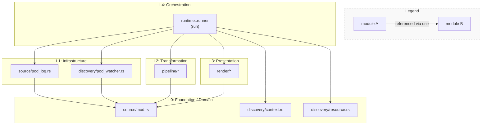
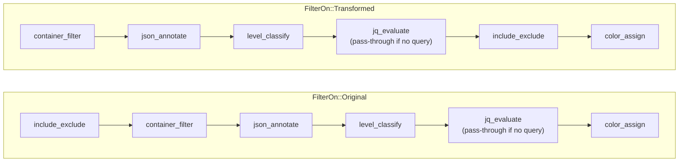
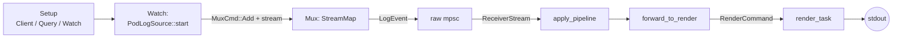
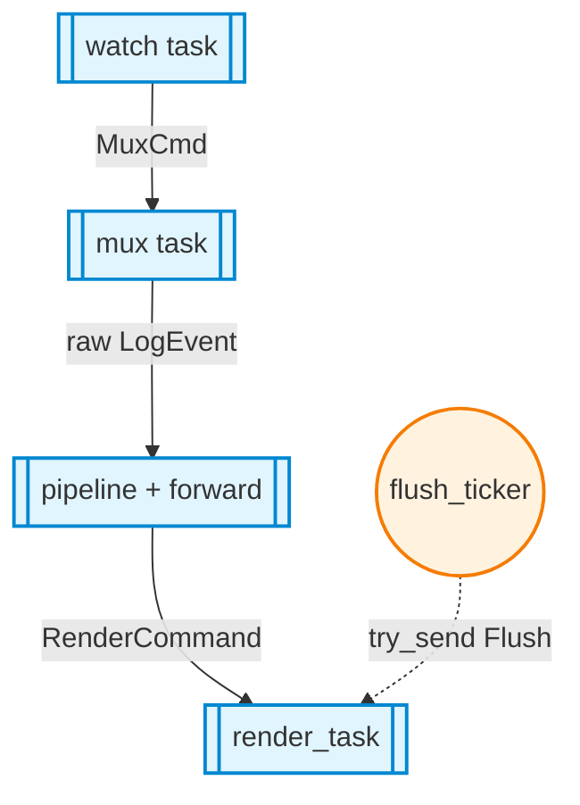
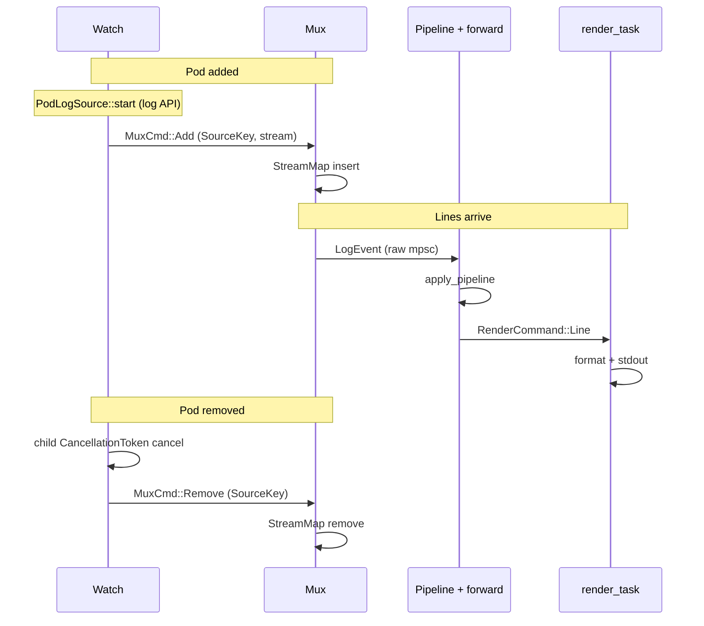

# rustern-core

Core library for the **rustern** CLI: it aggregates logs from many pods and containers on Kubernetes. The API covers cluster connection, pod watch, opening log streams, per-line transforms (pipeline), and writing to stdout.

Workspace-wide user-facing docs live in the repository root [`README.md`](../../README.md). This file is **developer documentation for the `rustern-core` crate only**. Diagrams use Mermaid (render on GitHub or any Mermaid-capable preview).

## Contents

1. [Prerequisites and commands](#prerequisites-and-commands)
2. [Source tree vs modules](#source-tree-vs-modules)
3. [Architecture (layers and dependencies)](#architecture-layers-and-dependencies)
4. [Pipeline order](#pipeline-order)
5. [`run` data flow and concurrency](#run-data-flow-and-concurrency)
6. [Public API](#public-api)
7. [Tests](#tests)
8. [v0.1 scope and notes](#v01-scope-and-notes)

## Prerequisites and commands

- Use the workspace [`rust-version`](../../Cargo.toml) for the Rust toolchain.
- Some integration tests use a mock API only; others depend on Kubernetes API behavior.

```bash
cargo test -p rustern-core
cargo clippy -p rustern-core --all-targets -- -D warnings
cargo doc -p rustern-core --open
```

## Source tree vs modules

Index of `src/` paths and roles.

| Path | Role |
|------|------|
| `lib.rs` | Public modules and `pub use` |
| `runtime/mod.rs` | Module layout and `pub use` (see below) |
| `runtime/runner.rs` | **`run`** (watch / spawn wiring) |
| `runtime/forward.rs` | **`forward_to_render`**, `LossyMetrics`, log semaphore |
| `runtime/pipeline.rs` | **`apply_pipeline`** (stream wrapper used only by `run`) |
| `runtime/config.rs` | **`CoreRunConfig`**, `RunError`, `RuntimeFwdConfig`, etc. |
| `source/mod.rs` | Domain types: `LogEvent`, `SourceKey`, `LogSource`, … |
| `source/pod_log.rs` | `PodLogSource` (log API → line stream) |
| `discovery/context.rs` | kubeconfig and `kube::Client` |
| `discovery/resource.rs` | Query string parsing (`kind/name` → selectors) |
| `discovery/workload_selector.rs` | `GET` workload → pod label selector (single-ns) |
| `discovery/pod_watcher.rs` | Pod → `SourceKey`, `reconcile` |
| `pipeline/*.rs` | Line-stream transforms (order fixed by `runtime`) |
| `render/mod.rs` | `RenderCommand`, `render_task`, `flush_ticker` |
| `render/default_renderer.rs`, `render/highlight.rs`, … | `LineFormatter` + stern-style emphasis |

## Architecture (layers and dependencies)

### Principles

- Lower layers avoid Kubernetes / I/O details where possible. `pipeline` and `render` only see `LogEvent` streams and never call the Pod API directly.
- Pipeline stages do not call each other across files; order lives in `runtime::apply_pipeline`.
- Kubernetes-specific logic stays in `discovery/*` and `source/pod_log.rs`.

### Diagram: layers and dependencies



`runtime::runner::run` references `discovery/context` and `discovery/resource` directly. `pod_watcher` and `pod_log` depend only on `source/mod` (`SourceKey`, etc.), not on `context` / `resource`.

### Layers explained

| Layer | Contents |
|-------|----------|
| **L0** | Types, kubeconfig, query parsing. Does not depend on other `rustern-core` modules. |
| **L1** | `pod_watcher`: Pod → `SourceKey`. `pod_log`: log API → `LogSource`. Both build on L0 models. |
| **L2** | Incremental transforms on `Result<LogEvent, LogSourceError>` streams. |
| **L3** | Single writer, formatting, flush. |
| **L4** | Channels, `StreamMap`, `tokio::spawn` wiring L1–L3 at runtime. |

## Pipeline order

Order inside `runtime::apply_pipeline`. Only include/exclude placement changes with `FilterOn`; the last stage is always `color_assign`.

### `FilterOn` branches

| Mode | include / exclude | Stages (top to bottom) |
|------|-------------------|-------------------------|
| **`FilterOn::Original`** | Raw message | `include_exclude` → `container_filter` → `json_annotate` → `level_classify` → `jq_evaluate` (optional) → `color_assign` |
| **`FilterOn::Transformed`** | After transforms | `container_filter` → `json_annotate` → `level_classify` → `jq_evaluate` (optional) → `include_exclude` → `color_assign` |

### Diagram: both paths



Without `json_query`, `jq_evaluate` is effectively optional plumbing; stage semantics match the table.

## `run` data flow and concurrency

### Steps

1. **Setup** — `build_client`, `parse_query`, `ListParams` / `WatchConfig` (`context` / `resource`); `kind/name` queries may **`GET`** a workload (`discovery::workload_selector`) when scoped to one namespace without `-l`.
2. **Watch** — Pod `Apply` / `Delete` / `Init*` via kube `watcher`.
3. **Keys and sources** — For each `SourceKey`, open logs with `PodLogSource::start`.
4. **Merge** — Combine streams with `StreamMap<SourceKey, _>` (mux task).
5. **Raw channel** — Send pre-pipeline `LogEvent` through mpsc (backpressure).
6. **Pipeline** — `ReceiverStream` → `apply_pipeline` (order above).
7. **Renderer** — `forward_to_render` sends `RenderCommand::Line`; optional post-format `render::highlight` layer for default output (stern `-H`/`-i` emphasis); `lossy` `try_send` drops update metrics.
8. **Output** — `render_task` writes via `LineFormatter`; `flush_ticker` triggers periodic flush.

**Shutdown** — Cancel `root_token` → `Shutdown` to renderer → tear down tasks → `run` returns.

### Diagram: data path



Opening the log API happens in **`PodLogSource::start`** (spawned from the watch task). The mux task inserts streams into `StreamMap` and forwards merged output to the raw mpsc. `MuxCmd::Remove` is omitted here.

### Diagram: concurrent tasks



Shows how `tokio::spawn` tasks split work inside `run`.

### Diagram: sequence (typical path)



The second argument of `MuxCmd::Add` is **`BoxedLogStream`** (log line stream). The mux task never calls the API; it only merges streams.

## Public API

- `run(CoreRunConfig) -> Result<RunOutcome, RunError>` — single entry point.
- `validate_filter`, `CompiledFilter` — validate expressions up front.
- `forward_to_render`, `build_log_request_semaphore`, `LossyMetrics` — wiring helpers and tests.

See `src/lib.rs` for the full re-export list.

## Tests

| Kind | Location |
|------|----------|
| Unit | `#[cfg(test)]` in `src/**/*.rs` |
| Integration | `tests/` (mock API, retries, cancellation, E2E smoke, …) |

## v0.1 scope and notes

- Log sources focus on pod logs; other `SourceKind` variants are not implemented.
- The CLI binary lives in the workspace root `rustern` crate; assembling `CoreRunConfig` is done there.
- When upgrading `kube` / `k8s-openapi`, start from `build_log_params` in `source/pod_log.rs` and the log stream types.
