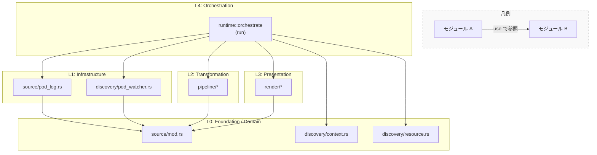
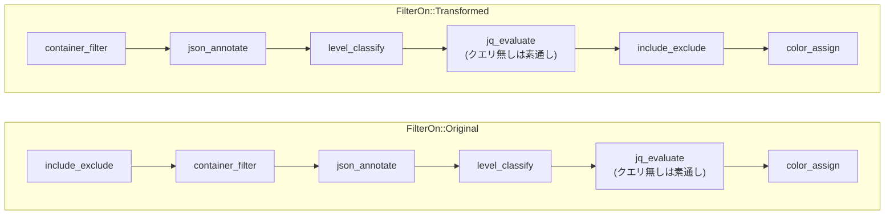
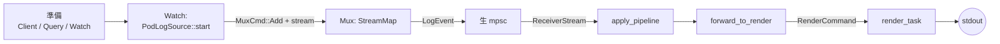
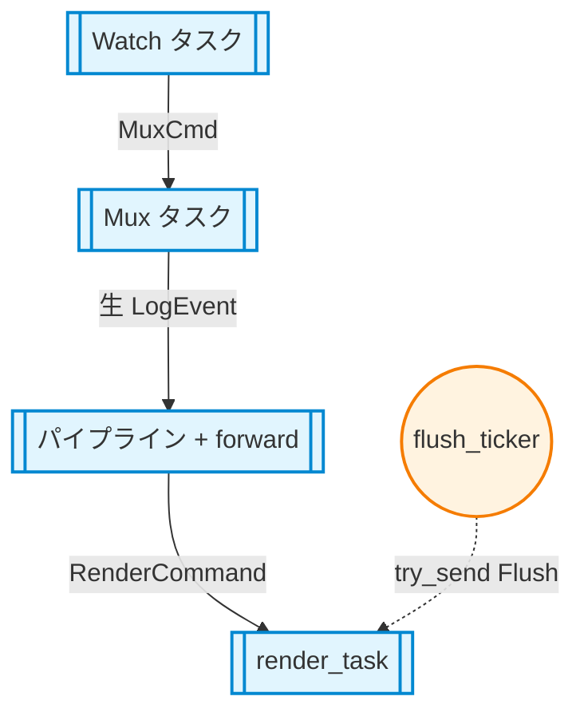
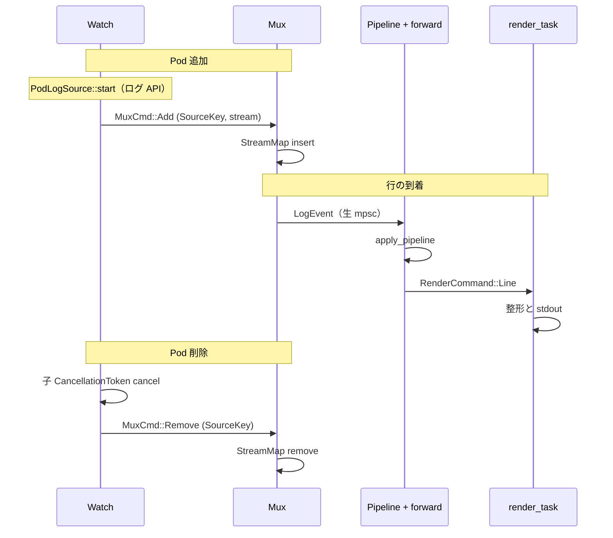

# rustern-core

Kubernetes 上の複数 Pod・コンテナのログを集約する CLI **rustern** の中核ライブラリです。クラスタ接続、Pod のウォッチ、ログストリームのオープン、行単位の変換（パイプライン）、標準出力への描画までをライブラリ API としてまとめています。

ワークスペース全体の利用者向けの説明はリポジトリルートの `README.md` を参照してください。このファイルは **`rustern-core` クレート専用の開発者向けドキュメント**です。図は Mermaid です。GitHub や対応プレビューで表示されます。

## 目次

1. [前提とコマンド](#前提とコマンド)
2. [ソースツリーとモジュール対応](#ソースツリーとモジュール対応)
3. [アーキテクチャ（層と依存）](#アーキテクチャ層と依存)
4. [パイプラインの処理順](#パイプラインの処理順)
5. [`run` のデータフローと並行処理](#run-のデータフローと並行処理)
6. [公開 API](#公開-api)
7. [テスト](#テスト)
8. [v0.1 のスコープと注意](#v01-のスコープと注意)

## 前提とコマンド

- Rust のバージョンはワークスペースの `rust-version` に従うこと。
- 統合テストの一部はモック API のみ、一部は Kubernetes API の挙動に依存します。

```bash
cargo test -p rustern-core
cargo clippy -p rustern-core --all-targets -- -D warnings
cargo doc -p rustern-core --open
```

## ソースツリーとモジュール対応

`src/` 配下のファイルと役割の対応（索引用）。

| パス | 役割 |
|------|------|
| `lib.rs` | 公開モジュールと `pub use` |
| `runtime/mod.rs` | モジュール構成と `pub use`（下表） |
| `runtime/orchestrate.rs` | **`run`**（watch / spawn 配線） |
| `runtime/forward.rs` | **`forward_to_render`**、`LossyMetrics`、ログ用セマフォ |
| `runtime/pipeline.rs` | **`apply_pipeline`**（`run` 専用のストリームラップ） |
| `runtime/config.rs` | **`CoreRunConfig`**、`RunError`、`RuntimeFwdConfig` など |
| `source/mod.rs` | `LogEvent`、`SourceKey`、`LogSource` などドメインモデル |
| `source/pod_log.rs` | `PodLogSource`（ログ API → 行ストリーム） |
| `discovery/context.rs` | kubeconfig と `kube::Client` |
| `discovery/resource.rs` | クエリ文字列のパース |
| `discovery/pod_watcher.rs` | Pod → `SourceKey`、`reconcile` |
| `pipeline/*.rs` | 行ストリーム変換（順序は `runtime` が固定） |
| `render/mod.rs` | `RenderCommand`、`render_task`、`flush_ticker` |
| `render/default_renderer.rs` ほか | `LineFormatter` 実装 |

## アーキテクチャ（層と依存）

### 考え方

- 下位の層ほど Kubernetes / 入出力から独立。`pipeline` と `render` は `LogEvent` ストリームのみを扱い、Pod API を直接呼ばない。
- `pipeline` 内のファイル同士は橋渡ししない。処理順は `runtime::apply_pipeline` に集約。
- Kubernetes 固有の処理は `discovery/*` と `source/pod_log.rs` に寄せ、境界で分離。

### 図：層と依存関係



`runtime::orchestrate` の `run` は `discovery/context` と `discovery/resource` を直接参照します。`pod_watcher` と `pod_log` は `source/mod`（`SourceKey` 等）のみを参照し、`context` / `resource` モジュールには依存しません。

### 層ごとの説明

| 層 | 内容 |
|----|------|
| **L0** | 型定義、kubeconfig、クエリパース。他 `rustern-core` モジュールに依存しない。 |
| **L1** | `pod_watcher` は Pod → `SourceKey` 等。`pod_log` はログ API → `LogSource`。いずれも L0 のモデルに依存。 |
| **L2** | `Result<LogEvent, LogSourceError>` のストリームを段階的に変換。 |
| **L3** | 単一 writer への集約、フォーマット、flush。 |
| **L4** | チャネル、`StreamMap`、`tokio::spawn` で L1〜L3 を実行時に接続。 |

## パイプラインの処理順

`runtime::apply_pipeline` における順序です。`FilterOn` で include / exclude の位置だけが変わり、最後は常に `color_assign` です。

### `FilterOn` による分岐（表）

| モード | include / exclude | 処理ステップ（上から順） |
|--------|-------------------|-------------------------|
| **`FilterOn::Original`** | 変換前のメッセージで絞り込み | `include_exclude` → `container_filter` → `json_annotate` → `level_classify` → `jq_evaluate`（任意）→ `color_assign` |
| **`FilterOn::Transformed`** | 変換後のメッセージで絞り込み | `container_filter` → `json_annotate` → `level_classify` → `jq_evaluate`（任意）→ `include_exclude` → `color_assign` |

### 図：上記 2 経路の比較



`json_query` が無い場合、`jq_evaluate` の有無は実装上のラップの差であり、段の意味は表どおりです。

## `run` のデータフローと並行処理

### 処理の流れ（段階別）

1. **準備** — `build_client`、`parse_query`、`ListParams` / `WatchConfig`（`context` / `resource`）。
2. **ウォッチ** — Pod の `Apply` / `Delete` / `Init*`（kube `watcher`）。
3. **キーとソース** — `SourceKey` ごとに `PodLogSource::start` でログストリームを開く。
4. **マージ** — `StreamMap<SourceKey, _>` で複数ストリームを統合（mux タスク）。
5. **生チャネル** — パイプライン前の `LogEvent` を mpsc で渡す（バックプレッシャ）。
6. **パイプライン** — `ReceiverStream` → `apply_pipeline`（前節の順）。
7. **レンダラ** — `forward_to_render` が `RenderCommand::Line` を送る。`lossy` 時は `try_send` 失敗でドロップとメトリクス。
8. **出力** — `render_task` が `LineFormatter` で書き、`flush_ticker` が間欠 flush。

**終了** — `root_token` をキャンセル → レンダラへ `Shutdown` → 関連タスクを片付けて `run` が return。

### 図：データの通路



ログ API を開くのは **`PodLogSource::start`**（watch タスク側が spawn）。mux は受け取ったストリームを `StreamMap` に載せ、統合結果を生 mpsc へ送る。`MuxCmd::Remove` は省略。

### 図：並行タスク



`run` 内の `tokio::spawn` したタスクの役割分担を示しています。

### 図：シーケンス（代表経路）



`MuxCmd::Add` の第 2 引数は **`BoxedLogStream`**（ログ行ストリーム）。mux は API を呼ばず、ストリームのマージのみ担当します。

## 公開 API

- `run(CoreRunConfig) -> Result<RunOutcome, RunError>` … 一体型のエントリ。
- `validate_filter`、`CompiledFilter` … 式の事前検証。
- `forward_to_render`、`build_log_request_semaphore`、`LossyMetrics` … 配線の再利用やテスト。

再エクスポートの一覧は `src/lib.rs` を参照してください。

## テスト

| 種類 | 場所 |
|------|------|
| 単体 | `src/**/*.rs` の `#[cfg(test)]` |
| 統合 | `tests/`（モック API、リトライ、キャンセル、E2E スモークなど） |

## v0.1 のスコープと注意

- ログソースは Pod ログが中心。`SourceKind` のその他の種別は未実装。
- CLI バイナリ（ルート `rustern` クレート）は別。`CoreRunConfig` の組み立てはワークスペース側。
- kube / k8s-openapi のバージョン追随では、`source/pod_log.rs` の `build_log_params` やログストリーム型が手掛かりになりやすい。
