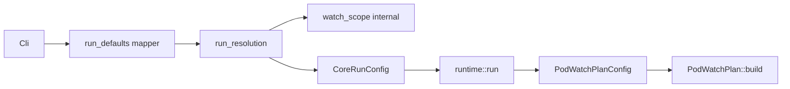

# ADR 0001: Run resolution module (`run_resolution`)

## Status

Accepted (DSK-69)

## Context

Pod query and namespace defaults were split across:

- `discovery::watch_scope` (core logic, `WatchScopeInput` / `WatchScopeResolved`)
- `src/run_defaults.rs` (CLI mapper + duplicated unit tests)
- `run_config` (called `resolved_pod_query` and `resolved_namespaces` separately)

R2 (unified CLI default resolution) needs a single core entry point without expanding `watch_scope` names into the public API.

## Decision

1. Add `discovery::run_resolution` with `RunResolutionInput`, `RunResolutionOutput`, and `resolve_run_input`.
2. Keep `run_defaults.rs` as a thin Cli → `RunResolutionInput` mapper.
3. Delegate to existing `watch_scope` functions internally (no logic fork).
4. Move stern-compat unit tests from `run_defaults` into `run_resolution`; keep CLI mapper smoke tests in `run_defaults`.

## Alternatives considered

| Option | Why not |
|--------|---------|
| Extend `watch_scope` in place | Renaming `WatchScope*` would churn callers; R2 wants clearer “run resolution” vocabulary |
| Fold into `PodWatchPlan::build` | Mixes list/watch API planning with CLI default resolution; wrong layer |

## Architecture

### Current (pre-R2 behavior, post-DSK-69 wiring)

### Target (R2 and beyond)

Same shape; `run_resolution` becomes the only public resolution API. `watch_scope` stays `pub` but documented as legacy/internal until a later removal pass.

## `watch_scope` future

- **Now**: `watch_scope` remains public; `run_resolution` wraps it.
- **Later**: mark `WatchScopeInput` / `resolve_watch_scope` `#[doc(hidden)]` or move fully private after R2 ships.
- **Not now**: no behavior change to selector-without-query, `.` sentinel, or namespace rules.

## R2 deferral criteria

Start R2 implementation only when all of the following hold:

1. **Scope signed off** — stern/kubectl parity requirements for default resolution are written in the R2 issue (not this ADR).
2. **Regression net** — `run_resolution` tests cover selector-without-query, `.` sentinel with `-l` / `--field-selector`, `-A`, explicit `-n`, kube context namespace.
3. **Workload expansion** — `deploy/name` → label selector behavior is specified (if in R2 scope).
4. **Migration path** — any breaking CLI change has a documented flag or release note; default path stays behavior-neutral until then.

## Consequences

- Core resolution logic and stern-compat tests live in one module.
- CLI / `run_config` test duplication reduced.
- `RunResolutionOutput::validation` provides a hook for R2 diagnostics without widening `CoreRunConfig`.
